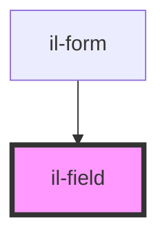

# il-field

<!-- Auto Generated Below -->

## Properties

| Property      | Attribute     | Description | Type                                                                                                                                                                            | Default                    |
| ------------- | ------------- | ----------- | ------------------------------------------------------------------------------------------------------------------------------------------------------------------------------- | -------------------------- |
| `isRequired`  | `is-required` |             | `boolean`                                                                                                                                                                       | `false`                    |
| `label`       | `label`       |             | `string`                                                                                                                                                                        | `undefined`                |
| `name`        | `name`        |             | `string`                                                                                                                                                                        | `undefined`                |
| `placeholder` | `placeholder` |             | `string`                                                                                                                                                                        | `undefined`                |
| `status`      | `status`      |             | `string`                                                                                                                                                                        | `FIELD_VARIATIONS.DEFAULT` |
| `type`        | `type`        |             | `TYPE_VARIATIONS.DATE \| TYPE_VARIATIONS.EMAIL \| TYPE_VARIATIONS.NUMBER \| TYPE_VARIATIONS.PASSWORD \| TYPE_VARIATIONS.SEARCH \| TYPE_VARIATIONS.TEXT \| TYPE_VARIATIONS.TIME` | `TYPE_VARIATIONS.TEXT`     |
| `value`       | `value`       |             | `string`                                                                                                                                                                        | `""`                       |

## Events

| Event         | Description | Type                                            |
| ------------- | ----------- | ----------------------------------------------- |
| `valueChange` |             | `CustomEvent<{ name: string; value: string; }>` |

## Dependencies

### Used by

 - [il-form](../il-form)

### Graph

----------------------------------------------

*Built with [StencilJS](https://stenciljs.com/)*
